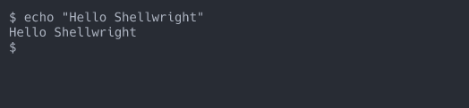
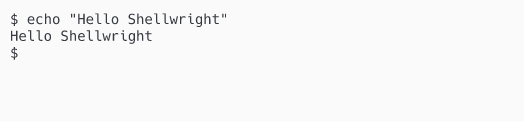
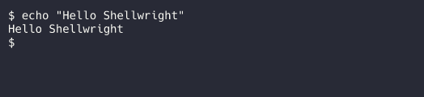
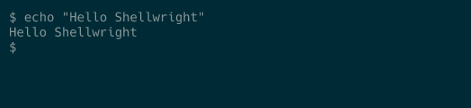
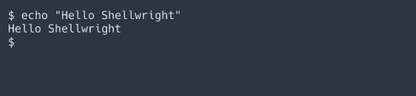

# Terminal Themes

Shellwright supports multiple color themes for screenshots and recordings. Set the theme when starting a session:

```json
{
  "command": "bash",
  "args": ["--login", "-i"],
  "theme": "dracula"
}
```

Or prompt your agent to use a specific theme, e.g:

> Create a shell recording of how to list files and folders and search for text, use the 'nord' theme.

## Available Themes

| Theme | Type | Description |
|-------|------|-------------|
| `one-dark` | Dark | Dark theme with muted, balanced colors (default) |
| `one-light` | Light | Light theme with clean, readable colors |
| `dracula` | Dark | Dark purple theme with vibrant colors |
| `solarized-dark` | Dark | Dark blue-green theme, easy on the eyes |
| `nord` | Dark | Arctic-inspired theme with cool blue tones |

## Theme Previews

### one-dark (default)

Dark theme with muted, balanced colors. Works well for most use cases.



### one-light

Light theme with clean, readable colors. Good for presentations and light mode screenshots.



### dracula

Dark purple theme with vibrant colors. Popular with developers, good for a more colorful look.



### solarized-dark

Dark blue-green theme, easy on the eyes. Designed for long coding sessions with reduced eye strain.



### nord

Arctic-inspired theme with cool blue tones. Clean and modern aesthetic.



## Tips

- Use `one-light` for presentations or documentation that will be viewed in light mode
- Use `dracula` or `nord` for a more vibrant dark look
- The default `one-dark` works well for most cases
- Different sessions can use different themes simultaneously
